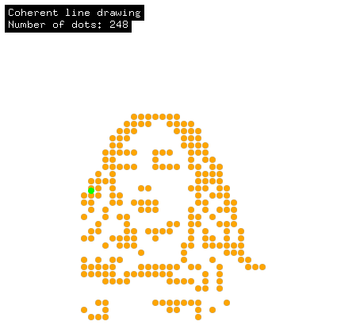

# paintball-paintings

Please check the online version of this repo, available here: [https://github.com/vvzen/paintball-portraits](https://github.com/vvzen/paintball-portraits)

The installation works by getting the live feed from a PS3 eye camera, waiting for the user input, then processing the PS3 cam image by using the [coherent line drawing algorithm](https://www.youtube.com/watch?v=48fTXKUTM-8), sampling the resulting black & white image with some dots and then streaming the coordinates of each point to the cnc machine via serial communication.

Below you can find an example of the sampling process applied to the processed image:

The serial communication is bundled inside the osc protocol for readability reasons: using raw byte buffers has definitely less overhead but there is no need for it in my case.

Everytime the of app sends a serial message to the arduino, it waits for the arduino to send back the same message as a response and then procedes with the next message, until each dot has been shot on the canvas.

The path of the gun is optimised using a nearest neighbour algorithm, which definitely outperforms any kind of genetic algorithm approach that I tested.
(have a look [here](https://github.com/vvzen/maca-final/tree/master/shortest-path-test))

## ARDUINO
Open the arduino sketch and upload it to the arduino.
Check the required libraries by looking at the top of the arduino sketch.

## OPENFRAMEWORKS
The openframeworks app requires several different addons:

1. ofxOpenCv
2. ofxPoco
3. ofxGui
4. ofxKinect (required for the libusb driver)
5. [ofxIO](https://github.com/bakercp/ofxIO)
6. [ofxSerial](https://github.com/bakercp/ofxSerial) 
7. [ofxCv](https://github.com/kylemcdonald/ofxCv)
8. [ofxPS3EyeGrabber](https://github.com/bakercp/ofxPS3EyeGrabber)
9. [ofxFaceTracker](https://github.com/kylemcdonald/ofxFaceTracker)

### Installing the addons
You can either run the `setup.py` using python3 (see below) or manually download each addon and put it in your openframeworks addons folder.

#### Using setup.py

The setup.py file will automagically download all the required addons that you don't have installed into your openframeworks addons folder.

1. Open the `setup.py` with a text editor and set the `OF_ROOT` variable to your openframeworks installation folder. In my case, it is `/Volumes/LaCie3TBYas/Code/c++/of_v0.10.0_osx_release` so I will change it like this:
`OF_ROOT="/Volumes/LaCie3TBYas/Code/c++/of_v0.10.0_osx_release"`

1. open a terminal window and `cd` into the main folder of this repo (maca-final)

2. run `python3 setup.py`
